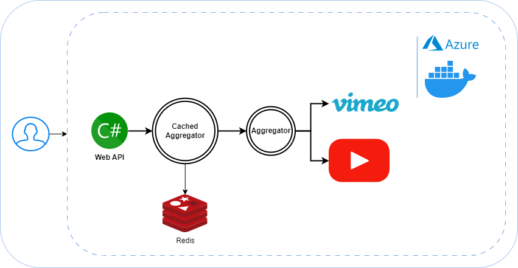

# Movie Search API

The Movie Search API is a C# web application that seamlessly connects to the Vimeo online movie database. Leveraging the vast collection of data from Vimeo, this API enables users to search for their favorite movies using specified search terms.

<p align="center">
  
</p>

## Features

* **Vimeo Integration:** Utilizes Vimeo's movie database to retrieve detailed information about movies based on user-defined search queries.

* **YouTube Integration:** Collaborates with YouTube to fetch relevant video URLs associated with the movies found in the Vimeo database. This enriches the user

* **Aggregation and Results:** Aggregates the information obtained from Vimeo and YouTube, creating a comprehensive set of results. These results include movie details and associated video URLs.

## Getting Started

## API Overview

The API I have developed incorporates the use of the Asp.Versioning NuGet package for version control and implementation.

### Asp.Net Versioning

I have organized the implementations into two versions: V1 and V2.

**V1:** Version 1 includes a straightforward implementation of a video aggregator.

**V2:** Version 2, on the other hand, utilizes the Chain of Responsibility pattern for both data aggregation and caching mechanisms, enhancing the overall functionality.

Feel free to explore each version based on your specific requirements and preferences.

## Directory Structure

```bash
├── MovieSearcher
├──src
│   ├── MovieSearcher.Core
│   ├── MovieSearcher.Services
│   ├── MovieSearcher.VimeoWrapper
│   ├── MovieSearcher.YoutubeWrapper
│   └── MovieSearcher.WebAPI
├──test
│   ├── MovieSearcher.Services.Tests
│   ├── MovieSearcher.VimeoWrapper.Tests
│   ├── MovieSearcher.YoutubeWrapper.Tests
│   └── MovieSearcher.WebAPI.Tests.Integration
├── README.md
├── Dockerfile
├── compose.yaml
└── .gitignore
```

## Project Descriptions

| Project | Description     |
| :-------- | :------- | 
| `src/MovieSearcher.Core` | Shared objects and logics for use |
| `src/MovieSearcher.Services` | Shared Services for aggreationg of diffirent projects |
| `src/MovieSearcher.VimeoWrapper` | Vimeo API connection services and objects  |
| `src/MovieSearcher.YoutubeWrapper` | Youtube API connections services and objects  |
| `src/MovieSearcher.WebAPI` | Main API  |
| `test/MovieSearcher.Services.Tests` | Unit tests for Shared Services |
| `test/MovieSearcher.VimeoWrapper.Tests` | Unit tests for Vimeo API services  |
| `test/MovieSearcher.YoutubeWrapper.Tests` | Unit tests for Youtube API services  |
| `test/MovieSearcher.WebAPI.Tests.Integration` | Main API integration tests. The test environment is set up using a Redis Testscontainer, allowing for comprehensive end-to-end testing of the API.|

#### 1. Clone the Repository
```bash
https://github.com/erkinisci/MovieSearcher.git
```

#### 2. Configure API Keys

You have the flexibility to seamlessly configure only Azure App Config using the instructions provided, or alternatively, opt for manual configurations.

**Azure APP Configuration**

https://learn.microsoft.com/en-us/azure/azure-app-configuration/


- Connections string and label for `Azure App Configuration` and running standalone app:

```json
"ConnectionStrings": {
    "AzureAppConfig": "*** Use your azure app config connection string"
  },
 "AzureAppConfigLabel": "you label"
```
- Connections string and label for `Azure App Configuration` and running `docker compose`:

```json
"ConnectionStrings": {
    "AzureAppConfig": "*** Use your azure app config connection string"
  },
 "AzureAppConfigLabel": "your label-docker"
```

**Manual Configuration**

- Open the `appsettings.json` file and provide the required API keys in the corresponding sections:

#### Vimeo Configuration:

```json
{
  "Vimeo": {
    "AccessToken": "Your Vimeo access token",
    "ClientId": "Your Vimeo client ID",
    "ClientSecret": "Your Vimeo client secret",
    "AppName": "VideoSearch",
    "Search": {
      "Fields": "*** If it is empty, it retrieves all details -but it can also be used as example below",
      "FieldsExample": "name,uri,description,link"
    }
  }
}
```

#### Youtube Configuration:

```json
{
  "Youtube": {
    "ApiKey": "Your YouTube API key",
    "ApplicationName": "VideoSearchApp",
    "MaxResults": 5
  }
}
```

#### Redis Configuration:

```json
"ConnectionStrings": {
    "RedisConnectionString": ""
}
```

#### 3. Build and Run

```bash
dotnet build
dotnet run
```

## Searching for Movies

#### 1. Make a GET Request

* Retrieves comprehensive details from the API in a paginated manner.

```bash
GET http://localhost:${Port}/api/v{version:apiVersion}/movies?query=yourSearchTerm
```

* Fetches comprehensive details from the API for a specified page.

```bash
GET http://localhost:${Port}/api/v{version:apiVersion}/movies?query=yourSearchTerm&page=1
```

* Retrieves comprehensive details from the API for a specified page, including information about a specified number of videos.
```bash
For instance, issuing this request yields details for 100 videos on Page 1.

GET http://localhost:5000/api/v{version:apiVersion}/movies?query=yourSearchTerm&page=1&perPage=100
```

#### 2. Review the Results

* The API will internally connect to Vimeo and YouTube, fetch relevant data, and aggregate the results.

* **Backend Service Caching** The response will be stored in cache database. (2 Hours; default)

* **Asp.Net OutputCache** - The response will be stored in cache database. (15 seconds; default)

```json
{
  "data":[
    {
      "video":{
        "id":156673345,
        "uri":"/videos/156673345"
        ...
      },
      "videoUrls":[
        "https://vimeo.com/156673345",
        "https://www.youtube.com/watch?v=gVosTabd_1M",
        "https://www.youtube.com/watch?v=vS1UY8KcY30",
        "https://www.youtube.com/watch?v=1NNcTnADt3k",
        "https://www.youtube.com/watch?v=MAX9qWiJx4U",
        "https://www.youtube.com/watch?v=6U4-KZSoe5g"
      ]
    }
  ]
}
```

## Using Docker Compose

* Sets up a local development environment in Docker, including a Redis database.

#### Docker Redis Configuration:

```json
"ConnectionStrings": {
    "RedisConnectionString": "your-redis-redis:6379"
}
```

1. **Build and Run the Containers:**

   Open a terminal in the same directory where `docker-compose.yml` file and run:

    ```bash
    docker-compose up --build
    ```

   This command builds and runs the Docker containers as defined in the `docker-compose.yml` file.

    ```bash
    docker-compose down
    ```

   This command kills the running container

2. **Access Your API:**

   Once the containers are running, your API should be accessible at `http://localhost:8080` in your browser or through any HTTP client.

### Additional Tips:

- **Running Main Branch:**
    - Builds and runs the containers in **Development** mode.

- **Running Prod Branch:**
    - Builds and runs the containers in **Build** mode.


## API Reference

## Vimeo Query Limitations

Vimeo imposes a maximum limit of 100 movies per query, with a default of 25 in the absence of specific query definitions.

#### Get all shows, returns paged data

```http
  GET /api/v{version:apiVersion}/movies?search=${yourSearchTerm}
```

| Parameter | Type     | Description                |
| :-------- | :------- | :------------------------- |
| `yourSearchTerm` | `string` | **Required** |

#### Get count of videos based on specified pageNumber

```http
  GET /api/v{version:apiVersion}/movies?search=${yourSearchTerm}&page=${pageNumber}
```

| Parameter | Type     | Description                       |
| :-------- | :------- | :-------------------------------- |
| `pageNumber`      | `string` | **Not Required**|


#### Get count of videos based on specified videoCount

```http
  GET /api/v{version:apiVersion}/movies?search=${yourSearchTerm}&page=${pageNumber}&perPage=${videoCount}
```

| Parameter | Type     | Description                       |
| :-------- | :------- | :-------------------------------- |
| `videoCount`      | `string` | **Not Required**.|

#### ***Possible Error from Vimeo API**

| Error | Type                   | Description                                                                                                         |
| :---- | :--------------------- | :------------------------------------------------------------------------------------------------------------------ |
| `500` | `InternalServerError` | This system employs an exponential retry mechanism for API errors, providing increased intervals with each attempt. |


## Youtube Data Query Limitations and Possible Errors

Please note that each request made to the YouTube API through this service incurs a cost of 100 units.

* Quata 10,000 units per day

https://developers.google.com/youtube/v3/guides/quota_and_compliance_audits
https://developers.google.com/youtube/v3/determine_quota_cost

#### ***Errors from Youtube API**

| Error | Type                   | Description                                                                                                         |
| :---- | :--------------------- | :------------------------------------------------------------------------------------------------------------------ |
| `502` | `BadGateway` | This system employs an exponential retry mechanism for API errors, providing increased intervals with each attempt. |
| `500` | `InternalServerError` | This system employs an exponential retry mechanism for API errors, providing increased intervals with each attempt. |
| `403` | `Forbidden` |  Not retriable - API will stop querying YouTube for further requests.  | 
| `400` | `Unauthorized` |  Not retriable - API will stop querying YouTube for further requests.  | 
